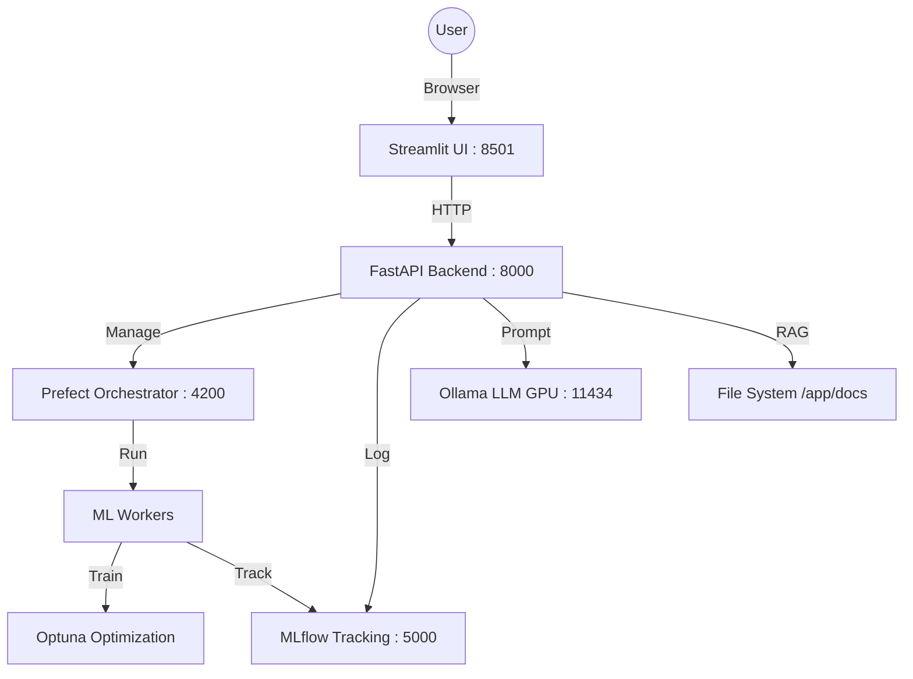
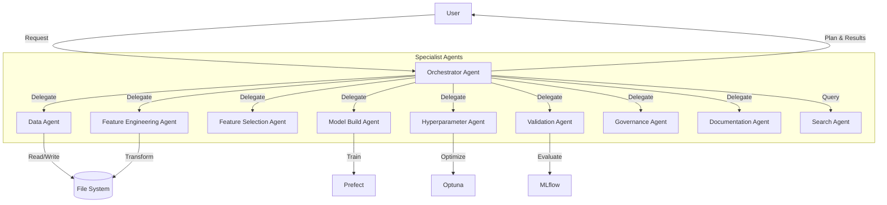

# FlowForge AI

**Agentic MLflow Model Development & Governance Platform**

FlowForge AI is an open-source, containerized Machine Learning platform that automates the end-to-end ML lifecycle using AI Agents. It features a Human-in-the-Loop workflow, ensuring you stay in control while AI handles the heavy lifting of EDA, Feature Engineering, and Model Optimization.


## 🏗️ Architecture

The system is composed of several Docker services orchestrated via Docker Compose:



### Key Components
- **Streamlit UI**: Interactive Wizard-style interface.
- **FastAPI Backend**: Handles requests, runs Agents, and manages file I/O.
- **Prefect**: Orchestrates long-running flows (Model Training).
- **MLflow**: Tracks experiments, metrics, and models.
- **Ollama**: Local LLM inference (Llama 3 recommended) for Agents.
- **Dozzle**: Real-time log viewer.

## 🚀 Getting Started

### Prerequisites
- **Docker** and **Docker Compose** installed.
- **NVIDIA GPU** & **NVIDIA Container Toolkit** (for Ollama acceleration).
  - *Note: If you don't have a GPU, modify `docker-compose.yml` to remove the `deploy` section under `ollama`.*

### Installation

1. **Clone the Repository**
   ```bash
   git clone https://github.com/quickSilverShanks/FlowForge-AI.git
   cd FlowForge-AI
   ```

2. **Start the Platform**
   ```bash
   docker-compose up --build -d
   ```
   *The first run will take time to build images.*

3. **Initialize Ollama Model**
   Once containers are running, download the LLM model (execute inside the ollama container or via API if implemented, typical manual step for first time):
   ```bash
   docker exec -it flowforge_ollama ollama pull llama3
   ```

### Configuration

You can configure the LLM model used by the agents by setting the `LLM_MODEL_NAME` environment variable in the `.env` file at the root of the project.

1.  Create a `.env` file (if not present):
    ```bash
    cp .env.example .env
    ```
2.  Edit `.env` and set your desired model:
    ```env
    LLM_MODEL_NAME=llama3
    ```
    *Note: Ensure the model you choose strictly matches the model name in Ollama.*

### Usage Guide

Access the services at the following URLs:

| Service | URL | Description |
| --- | --- | --- |
| **App UI** | `http://localhost:8501` | Main Interface (Streamlit) |
| **Backend API** | `http://localhost:8000/docs` | API Swagger |
| **MLflow** | `http://localhost:5000` | Experiment Tracking |
| **Prefect** | `http://localhost:4200` | Workflow Orchestration |
| **Logs** | `http://localhost:8888` | Container Logs |

### 🧪 Workflow Steps

1.  **Data Upload**: Go to the "Data Upload" page and upload your CSV/Parquet file. Define your Target column.
2.  **EDA**: Switch to "EDA". Click "Run AI Analysis". The Agent will generate a "Vibe Check" and statistical summary.
3.  **Feature Engineering**: Go to "Feature Engineering". The Agent will propose a plan (Imputation, Encoding, etc.). Review, Edit, and Apply it.
4.  **Model Training**: Go to "Model Training". The Agent proposes a search space. Click "Start Training" to trigger the Prefect Flow. Watch the progress in the Prefect Dashboard.
5.  **Validation**: Evaluate fairness and performance on OOT data.
6.  **Monitoring**: Generate a drift detection config.
7.  **Final Report**: Chat with the `RAG Agent` to ask questions about what happened during the session (e.g., "Why did we drop the Age column?").

## 🧠 Agentic Architecture

FlowForge AI employs a **Multi-Agent System** where a central **Orchestrator** manages specialized agents to complete complex data science tasks.

### Interaction Graph



### How it Works
1.  **Orchestrator**: The brain of the operation. It receives user requests (e.g., "Train a model on this dataset"), breaks them down into a step-by-step plan, and delegates each step to the appropriate specialist agent.
2.  **Specialist Agents**: Each agent is an expert in one domain (e.g., the `DataAgent` knows how to load and analyze data, the `FeatureEngineeringAgent` knows how to impute and encode). They execute their specific tasks using defined tools and report back to the Orchestrator.
3.  **Context Management**: The Orchestrator maintains the global context of the project, ensuring that subsequent agents have the information they need (like the current dataset filename or the target variable) from previous steps.

## 🧪 Testing

The project includes a comprehensive test suite to verify the agentic workflow and individual components.

### Running Tests in Docker

Since the application runs in Docker, the best way to run tests is inside the `backend` container.

1.  **Ensure the stack is running**:
    ```bash
    docker-compose up -d
    ```

2.  **Run the tests**:
    ```bash
    docker-compose exec backend pytest tests/
    ```

    Or to run a specific test file:
    ```bash
    docker-compose exec backend pytest tests/test_agents.py
    ```

## 🛠️ Development

- **Backend Code**: `app/api/`
- **UI Code**: `app/ui/`
- **Agents**: `app/core/agents/`
- **ML Logic**: `app/core/ml/`

To add a new dependency, update `requirements.txt` and rebuild:
```bash
docker-compose up --build -d
```
